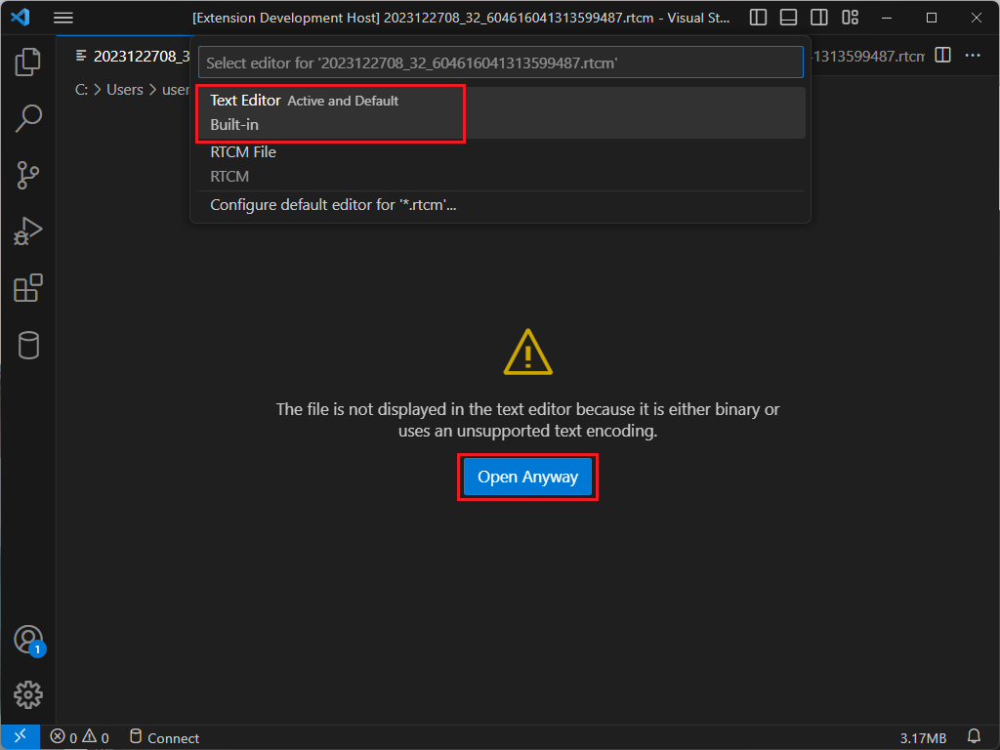
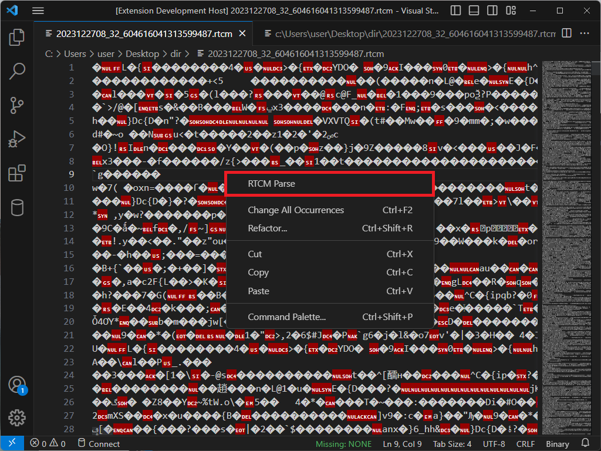
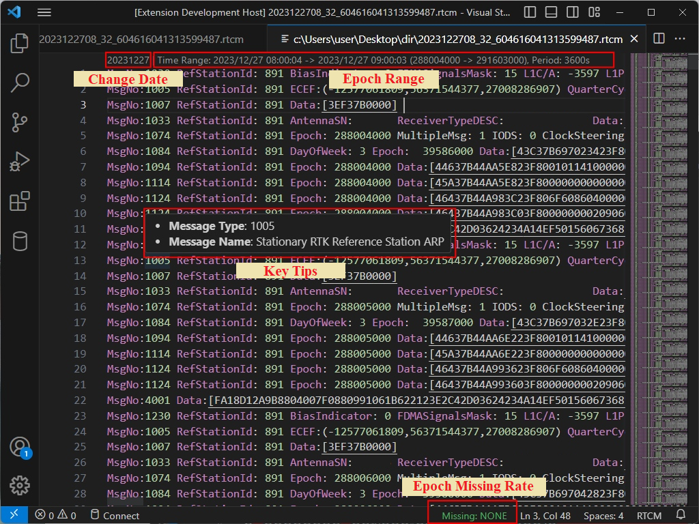
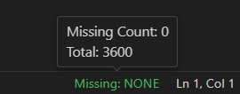
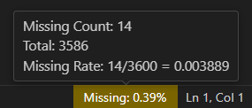
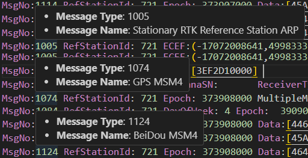

# RTCM

RTCM扩展是一个用于VSCode的扩展插件，用来解析和显示RTCM协议的文件内容.

## 如何使用

* 通过二进制(Binary)格式打开RTCM文件

* 右击 -> 选择 RTCM Parse

* 完成

## 功能特性

* 解析RTCM协议文件
* 解析历元范围
* 改变数据采集的日期
* 计算历元缺失率

* 关键含义提示

## 设置

支持如下扩展设置:

* `rtcm.epochRange.enable`: 启用/禁用解析历元范围功能.
* `rtcm.epochMissingRate.enable`: 启用/禁用计算历元缺失率功能.

## 发行说明

查看发行说明 [这里](CHANGELOG.md)

---

## 更多信息

* [RTCM协议标准](https://www.rtcm.org/)

RTCM（Radio Technical Commission for Marine Services）是无线电航海服务技术委员会的缩写，负责制定和维护无线电导航和定位系统的标准和协议。RTCM标准主要用于船舶导航和定位系统，但也可用于其他类型的导航和定位应用。
