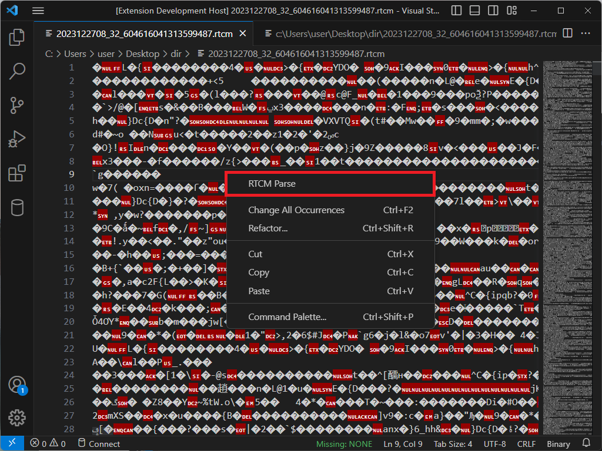
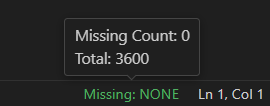
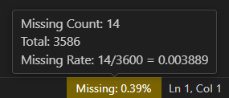
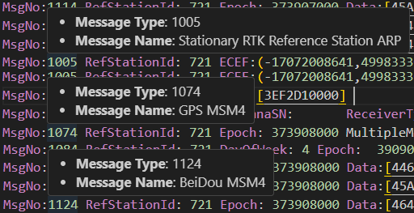

# RTCM

The RTCM extension is an extension for VSCode that parses and displays the RTCM files.

## Usages

* Open RTCM Files by Binary -> Open Anyway -> Text Editor

* Right Click -> RTCM Parse

* Done

## Features

* Parse RTCM files
* Epoch Range
* Change Date
* Epoch Missing Rate

* Key Tips

## Extension Settings

This extension contributes the following settings:

* `rtcm.epochRange.enable`: Enable/disable the Epoch Range feature.
* `rtcm.epochMissingRate.enable`: Enable/disable the Epoch Missing Rate feature.

## Release Notes

See Change Log [here](CHANGELOG.md)

---

## For more information

* [RTCM STANDARD](https://www.rtcm.org/)

**Enjoy!**
